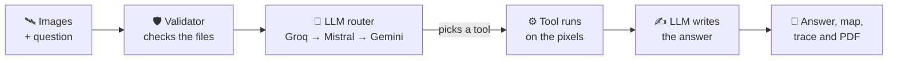

<div align="center">

# 🛰️ SatQuery AI

**Ask questions about satellite images in plain English.**

Upload an image, type a question like *"what changed here?"* or *"how much of this is forest?"*,
and get a measured answer with a highlighted map and a PDF report.


</div>

---

## ✨ What it does

You give it **one or two satellite images** and a **question**. SatQuery picks the right tool,
runs it on the actual pixels, and tells you what it found.

| 💬 You ask | 🔧 What runs | 📦 What you get |
|---|---|---|
| *"Describe this scene."* | Vision model (Moondream2) | A short description |
| *"What land cover is visible?"* | Vision model (Moondream2) | A direct answer |
| *"Highlight the buildings."* | Vision model pointing | Boxes drawn on the image |
| *"How much of this is trees?"* | Land-cover measurement | % of the image and area in hectares |
| *"What changed between these dates?"* | Change detection (2 images) | A change map and the % changed |
| *"How much is water?"* (optical + radar) | Optical + radar fusion | Where both sensors agree and disagree |

Every answer comes with:

- ✅ **The answer** in 2–4 plain sentences
- 🗺️ **A picture** with the findings drawn on it
- 🔍 **The steps that ran**, so you can see how it got there
- 📊 **A confidence score** with its maths shown
- 📄 **A one-page PDF report** you can download

---

## 🧠 How it works



> [!IMPORTANT]
> **The AI never makes up a number.**
> The language model only does two things: it picks which tool to run, and it writes the final sentence.
> Every number comes from plain maths on the pixels, so the same image always gives the same result.

If one LLM provider is down or out of free quota, it switches to the next one. If all three are down,
a simple keyword router takes over so the app keeps working.

---

## 📈 Results

| What we measured | Result |
|---|---|
| 🎯 Satellite vocabulary after fine-tuning (label F1 on 20 held-out BigEarthNet patches) | **0.000 → 0.387** |
| ⏱️ Fine-tuning time (LoRA, 2 epochs, RTX 4060 laptop) | **~12 minutes** |
| 💾 GPU memory to run the vision model | **4.4 GB** |
| 🧩 LoRA adapter size | **4.7 MB** |

Before fine-tuning, Moondream2 described satellite scenes as *"grass and dirt"*.
After, it uses proper land-cover terms like *"broad-leaved forest"* and *"complex cultivation patterns"*.

---

## 🚀 Quick start

**You need:** Python, an NVIDIA GPU with 6 GB or more (it also runs on CPU, just slower), and free API keys from
[Groq](https://console.groq.com), [Mistral](https://console.mistral.ai), [Google AI Studio](https://aistudio.google.com) and [Hugging Face](https://huggingface.co).

**1. Get the code and install packages**

```bash
git clone https://github.com/adithyachigullapally/SatQuery-.git
cd SatQuery-
python -m venv venv
venv\Scripts\activate          # on Mac/Linux: source venv/bin/activate
pip install torch --index-url https://download.pytorch.org/whl/cu124
pip install -r requirements.txt
```

**2. Add your API keys**

Copy `.env.example` to `backend/.env` and fill in your keys.

**3. Download the vision model** (about 4 GB)

```bash
python -c "from huggingface_hub import snapshot_download; snapshot_download('vikhyatk/moondream2', revision='2025-06-21', local_dir='weights/moondream2')"
```

**4. Run it**

```bash
python -m uvicorn backend.main:app --reload
```

Open **http://127.0.0.1:8000** and upload an image. 🎉

> [!TIP]
> The first question takes about 8 seconds while the model loads onto the GPU. After that it's fast.
> For hectares, upload a GeoTIFF, or type the metres-per-pixel value for a PNG/JPEG.

---

## 📁 Project structure

```
SatQuery-/
├── backend/
│   ├── main.py            → web server (FastAPI)
│   ├── validator.py       → checks uploaded images
│   ├── report.py          → makes the PDF
│   ├── agent/             → the LLM router and the loop
│   ├── tools/             → the tools that measure the images
│   └── models/            → the fine-tuned LoRA adapter
├── frontend/index.html    → the whole web interface
├── training/              → data download and fine-tuning scripts
└── tests/                 → checks for every part
```

📖 Want the full story? **[HOW_THIS_PROJECT_WORKS.md](HOW_THIS_PROJECT_WORKS.md)** explains every file and every formula in plain words.

---

## 🧪 Running the checks

```bash
python -m tests.test_pipeline      # full request, no GPU needed
python -m tests.test_matrix        # every task type, live (uses GPU + API quota)
```

<details>
<summary>All checks</summary>

```bash
python backend/validator.py                 # image validation rules
python -m backend.tools.change_analysis     # against LEVIR-CD ground truth
python -m backend.tools.fusion_analysis     # optical + radar on real data
python -m backend.tools.land_cover          # area maths on a known scene
python -m backend.tools.vlm                 # loads the vision model
python -m backend.agent.controller          # routing, offline
python -m backend.report                    # PDF renders
python -m tests.test_domain_adaptation      # LoRA F1 on held-out patches
python -m training.lora_finetune --smoke    # training loss must fall
python tests/check_providers.py             # all three LLM providers
```

</details>

<details>
<summary>Sample data and re-training</summary>

```bash
python -m training.prepare_bigearthnet 12          # fetch optical + radar sample patches
python -m training.prepare_bigearthnet train 300   # build the LoRA training set
python -m training.lora_finetune --epochs 2        # re-train the adapter (~12 min)
```

</details>

---

## ⚠️ Known limitations

- **Change detection is simple.** It doesn't use a trained model, so it scores low overlap
  (IoU about 0.1–0.25) against LEVIR-CD ground truth and can miss large new buildings.
- **No infrared band means no water estimate.** With plain RGB images, dark water, dark roofs and shadows look the same.
- **No resolution means no hectares.** The app reports percentages and says why, instead of guessing.
- **Radar and optical thresholds are tuned for Sentinel-1/2.** Other satellites need new values.
- **Built for a hackathon demo.** There is no login, and the API is open to any website.

---

## 🛠️ Built with

| Part | Tool |
|---|---|
| Web server | FastAPI |
| Vision model | Moondream2 + our own LoRA adapter (PEFT) |
| LLM router | Groq, Mistral, Gemini (free tiers) |
| Image maths | NumPy, scikit-image, rasterio |
| PDF reports | fpdf2 |
| Datasets | BigEarthNet (Sentinel-1/2), LEVIR-CD |
